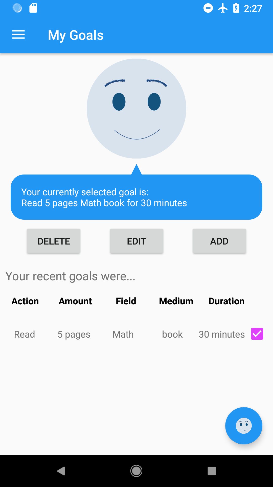
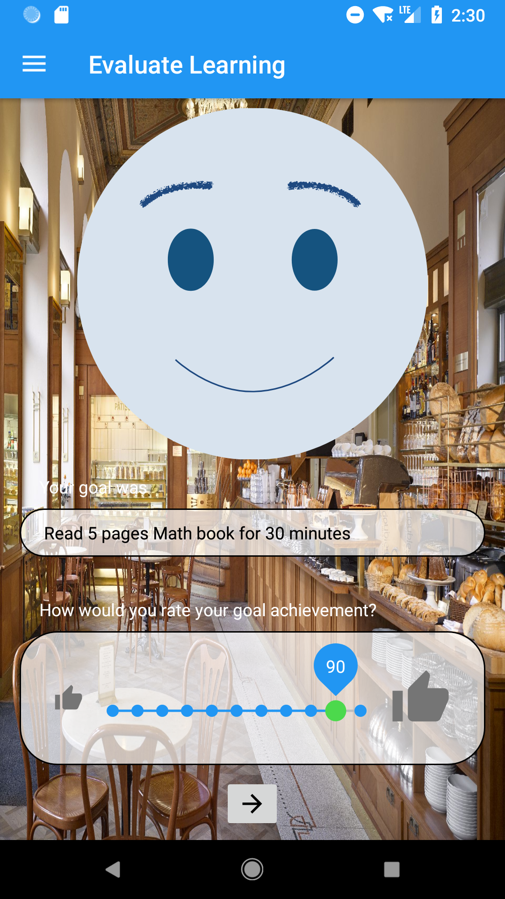

# Learning Companion

Learning Companion is a mobile application supporting a user with the process of reflecting his learning behaviour.

The main goal of this application is to assist you with your learning by letting you add goals, add your learning places, start learning sessions which are evaluated (by both the user itself and the application) so that eventually the user gets an overview of his learning experiences and his best places to learn.

# Flow

The general flow of the application is as follows:

1. You are greeted by your 'buddy' (learning companion) on the welcome screen.

</img>

2. You are directed to your home screen featuring your current goal and place (if any).

</img>
</img>

3. You check if your current goal and place fit your needs and if they don't you head over to the goal and place overview and choose different ones.

</img>
</img>
</img>

4. You click the 'Start' button on the home screen to start your learning session and <b>start learning</b>. A 'Quit' button becomes available and you can click your buddy to get tips and motivational text.

</img>

5. After your set time runs out or you decide to quit early, you are redirected to the evaluation screen. Now you can evaluate in how far you think you achieved your goal and how your environment was.

Note: If you enabled sensors beforehand, you cannot manually evaluate the place as the application will do this for you (based on light and microphone sensors).

</img>
</img>

6. Afterwards you are redirected to the overview of your recent learning sessions. You can click on entries to open a more detailed view of that particular session.

</img>
</img>

# Additional views

## Adding a new place

When adding a new place you can set a name, address and add a picture (from gallery or camera) which will be shown in your home screen when this place is selected as your current place.
You can click on 'Get my current address' to open a new view with a map, where the application will try to get your current location and create an address from your coordinates.

</img>
</img>

## Adding a new goal

The application will offer help when you start adding a new goal.
When you answer 'No' to the question 'Do you know how to set a goal?' you get assisted guidance through the process of setting a descriptive learning goal. 

</img>
</img>
</img>
</img>
</img>
</img>
</img>
</img>

## Settings

Some parts are configurable in the app settings. 
You can:
 - Set your name,
 - Edit the name of your learning companion, 
 - Change the image / color of your learning companion,
 - View granted permissions,
 - and change the interval/frequency of received alerts.

</img>

# Background

This project was developed as part of the 'Projektstudium' module at the HTW-Berlin.

The documentation which contains information about the whole process can be found [here](docs/doc.pdf).
The slides used for the presentation are available [here](docs/presentation.pdf) (German language only).
